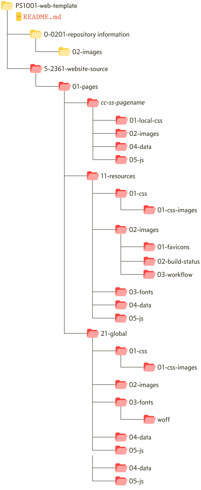
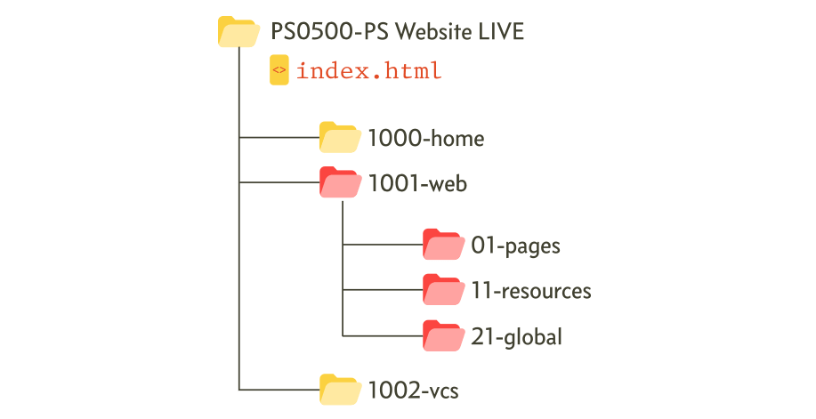

# File revision information

The current version of this file is:


# Repository basic information
Both the remote and the local repositories are called:

```PS1001-web-template```

The repository description is:

**The Practical Series website explaining how to develop responsive website (using HTML 5 and CSS 3) that looks good, is easy to navigate and has complex elements such as formulae, code fragments and lightbox imagery. The website itself contains a reusable template de-signed to hold whatever document or publication is directed at it. It’s well set out, has a range of nice and consistent styles and navigations that can be used with almost no effort.**.

The main purpose of the repository is to hold the web template website content (web pages, images, example code &c.) and the down-loadable template itself. The repository also holds some additional information: various workflow diagrams showing the commit points and branches throughout the history of the repository.

*Note: The Workflow Diagrams are maintained outside the repository but are copied in at specific commit points to maintain the accuracy of the repository.*

# Contributors and organisations
The following users are contributors to the repository:


| Type               | Contributor
| ------------------ | --------------------------------------
| Owner              | @mgledhill
| Read-write access  | @practicalseries
| Read-write access  | @practicalseries-lab

The repository is associates with the following organisations

| Organisations      |
| ------------------ |
| @practicalseries   |


# Local repository information &<br> conversion to website procedure
#### Author’s note to himself
The local repository is stored on the primary NAS drive and has the location:

```\\41 Pa_Archive\2500 Git Projects\PS1001-web-template```

The repository folder structure is:

<p align="left">
    
</p>

The red folders are the publishable website (the bit that has to be uploaded to the web server). However, this is just the VCS section of the website; the website itself contains other publications, all of which are contained in their own subfolders within the website.

The full offline version of the live website is stored on the primary NAS drive and has the location:

```\\01 Pa_Clavis\2230 PS Projects\PS0500-PS Website LIVE```

The high level folder structure for the website is:

<p align="left">
    
</p>

To update the live website with the repository website, the entire contents of the repository folder:

```5-2361-website-source```

Must be copied to the live website folder:

```1001-web```

The contents of the ```1001-web``` can be completely deleted prior to the repository folder files being copied in.

**NO INFORMATION SHOULD EVER BE MOVED FROM PS0500 TO THE REPOSITORY**

# Non-repository folders
The latest copy of the website Functional Specification Word Document (it contains the Word copy of the website content) is held in the project folder: 

```\\01 Pa_Clavis\2230 PS Projects\PS1001 - Web Template```

This is the primary project storage location. 

The local repository is copied in its entirety to a zip file at each published or released commit point. These zip file backups are stored in the primary project area (above) as recoverable project backups.

The workflow directory holds copies of the workflow drawings as both minimised SVG and PNG files. The original documents are again stored in the principal project folder given above.