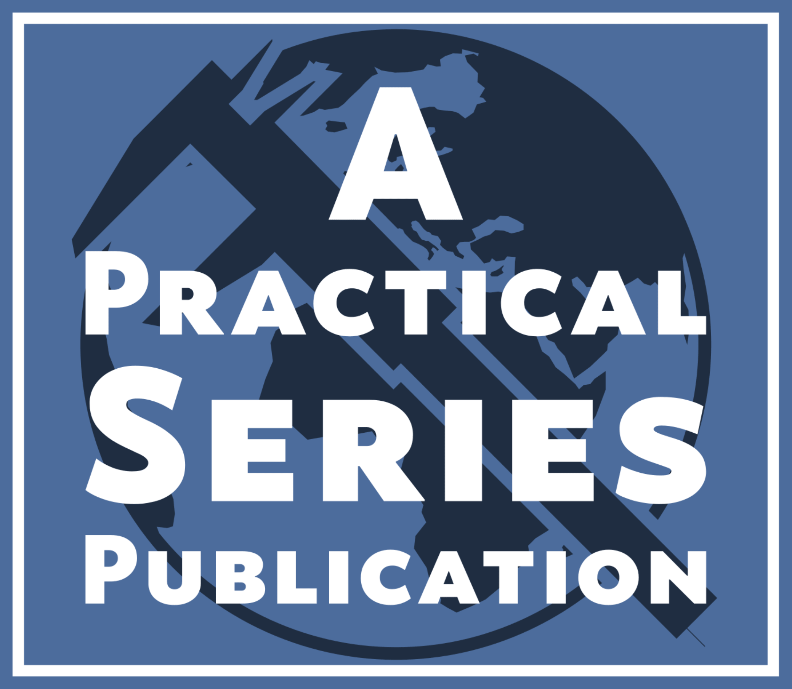

# &copy; Practical Series of Publications

###### A series of technical documents for engineers (and others)


# A Website Template for Online Publications 

<p align="center">
    
</p>

This is the website source code for the Practical Series of Publications website:
**A Website Template for Online Publications**.


## Revision information

The master branch only contains either finished publishable work or a completed and released website. 

Publishable work is a section of the website that is complete in itself—it does not indicate that the whole website is finished, just that the section in question is complete, tested and deployable.

Development work always takes place on a separate branch. Development branches always spur from some published or released point on the master branch.

**The current published and development status is:**


| Branch             | Revision
| ------------------ | --------------------------------------
| master             | 


## Contents

This publication (website) is, in effect an online book. The purpose of this book is to explain how to build a responsive website that looks good, is easy to navigate and has complex elements such as formulae, code fragments and lightbox imagery. There is also a template for this website that you are free to use to hold your own website. The website itself explains how this template was designed, what it does and how to use it.

The template itself is a website prototype that is designed to hold whatever document or publication is directed at it. It’s well set out, has a range of nice and consistent styles and navigations that can be used with almost no effort.

The actual website content explains how I’ve coded each section of the template, how new sections can be added and how to format the various components of the website; in short I explain everything from scratch:

1.	Making the site responsive (responds to different width browsers), I used a Karl Gerstner grid arrangement (read on) Installing Git
2.	Formatting text to give a pleasing layout and appearance
3.	Configuring responsive side bars
4.	Different types of headings
5.	Incorporating figures, tables and footnotes
6.	Navigation and links
7.	Structuring a website (the underlying folders and files that hold everything)
8.	Using jQuery for scrolling, displaying images with a “lightbox”, code fragments and formulae

I’ve even included some other things that you may find useful:

*	Using scalable graphics
*	Creating icon fonts
*	Optimising code and graphics
*	How to move content from Word to the website without going mad
*	Pictures of my dogs (maybe not so useful)

I also explain how to upload a website to a host and maintain it.

## Installation

There are no installation requirements for the website itself (it’s just a website—*obviously you need a browser, but you wouldn’t be here if you didn’t have that*).

However, I extensively use the Brackets text editor with the various extension and you will need to Install [Brackets](http://brackets.io/)

I give very detailed instructions explaining how to do all of this on the website and within the associated PDF document.

## Permissions in lieu of a licence

### THIS REPOSITORY IS NOT OPEN SOURCE

Everything in this repository belongs to me and not you.

I give you permission to use this repository to learn about website design and development and how to make online publications.

I also give you permission to reuse or adapt any of the website source code, specifically the JavaScript, CSS and HTML elements for your own website projects. 

I also make freely available the empty website template (see **TEMPLATE Licence** below)

**I do NOT** give permission for you to reuse or republish any of the content of this website or documents within this repository (including text, images, and PDFs).

**I do NOT** give permission for you to reuse the fonts that are embedded within the CSS files; these are purchased third party fonts—you may buy your own copy [here](https://practicaltypography.com/equity.html).

## The TEMPLATE licence

This repository holds both the actual website (the thing that explains how to build websites) and an empty template that can be used as the basis for a website.

The actual website itself is not open source (see **Permissions in lieu of a licence** above).

The downloadable template is open source and is available under the MIT Licence


## Development branch abbreviations

All development branches begin with a lower case 'd', the bulk of the development work takes place within the website itself (the directory starting 5-2361) and development branches associated with this area have the simplest designation (d-). Other workflows have longer designations, these being in the form ```dXX-``` where ```XX``` are two uppercase letters that specify the appropriate area.

The following table contains the development branch abbreviations and associated workflow areas (folders):

| Development<br>branch abbreviation  | Associated repository folder
| ------------------ | --------------------------------------
| d-                 | 5-2361-website-source
| dAD-               | 0-0201-repostiory-information (admin)

## Workflow status

The following shows the project status as workflow diagrams:


## Additional information

Additional detailed information about this repository and its local counterpart (including contributors, descriptions, publishing mechanisms &c.) is held in the [repository-info.md]( /0-0201-repository-information/repository-info.md) file
